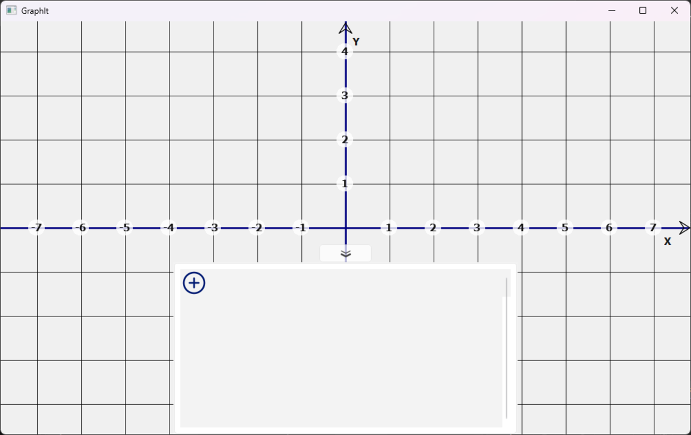
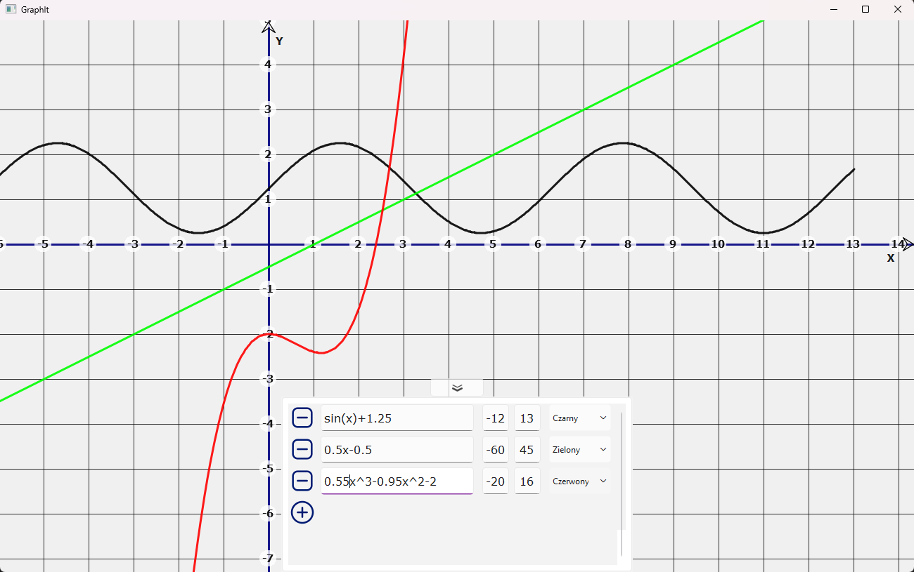

# GraphIt - Interactive Function Plotter

## Project Overview
GraphIt is a lightweight desktop graph plotting application written in **C++ using the Qt framework**.  
It allows interactive visualization of mathematical functions and smooth navigation across the coordinate system by dragging the view.

The application focuses on responsiveness and deterministic rendering. Function values are precomputed once and then efficiently rendered, which allows smooth panning even with multiple plots.

> 📖 Detailed technical description: [**docs/architecture.md**](docs/architecture.md)

---
## Key Features

- Plot mathematical expressions from text (ExprTk parser)
- Multiple functions displayed simultaneously
- Adjustable domain per function
- Automatic rebuild after input change (debounced updates)
- Smooth panning (dragging the coordinate plane)
- Deterministic frame rendering independent of expression complexity

---
## Example screenshots

**Main window after startup**  

**Multiple functions example**  

---
## Requirements

- C++17 compatible compiler
- Qt 6 (Core, Gui, Widgets)
- CMake ≥ 3.16 (not required when using Qt Creator)

---

## Installation

### 1. Using Qt Creator (recommended)

1. Install Qt Creator with Qt 6 Widgets module
2. Open `GraphIt.pro`
3. Select a Desktop Qt 6 kit
4. Build & Run

---

### 2. Using CMake (MSVC / CLion / other IDEs)

*(Instructions will be added — project already supports CMake configuration)*

---

### 3. Pure CMake build (Windows / Linux)

*(Planned — cross‑platform instructions will be provided later)*

---

## Usage

1. Launch the application — an empty coordinate system appears
2. In the bottom panel enter a function: `y := expression`
3. Set domain range (from / to)
4. Choose color (default is black)
5. The plot appears automatically after a short delay
6. Drag inside the window to navigate the coordinate system

---

## Current Limitations
* No zoom yet (fixed scale)
* The renderer does not currently split plots at asymptotes or undefined points, so functions with discontinuities (e.g. `1/x`, `tan(x)`) can be plotted incorrectly
* Sampling density is fixed and not dependent on zoom level
  
---
## Possible Future Improvements

- Smooth zooming instead of discrete translation
- Viewport‑based sampling (functions without predefined domain)
- Adaptive sampling density
- Detection of discontinuities / asymptotes
- Function legend and visibility toggling
- Export graph to image / SVG
- Keyboard navigation shortcuts
- Theme support (dark mode)

Some of these would require changing the rendering model from precomputed coordinate‑space sampling to dynamic screen‑space evaluation.

---
## License

This project is licensed under the MIT License — see `LICENSE`.  
Third‑party licenses are listed in `THIRD_PARTY_LICENSES`.

---
## Third‑party libraries
-> [ExprTk](https://www.partow.net/programming/exprtk/index.html) — C++ Mathematical Expression Library (MIT License) by Arash Partow
  

